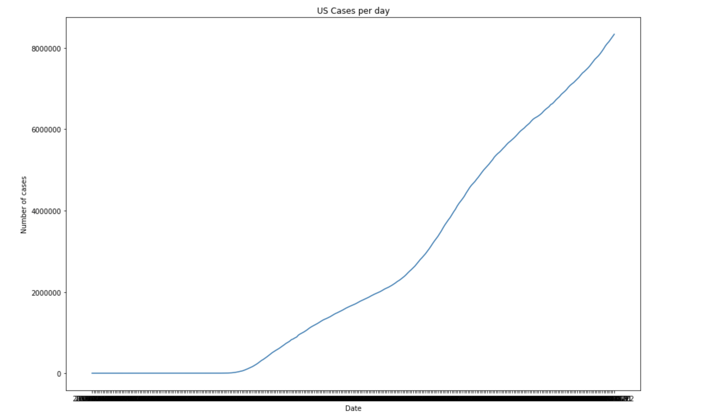
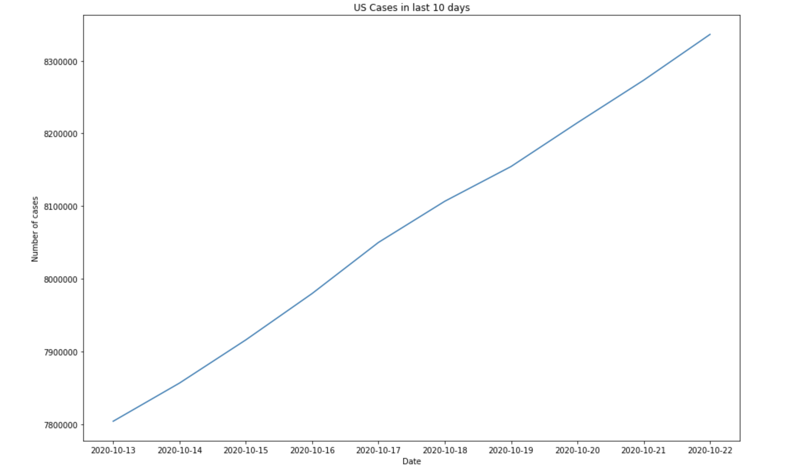
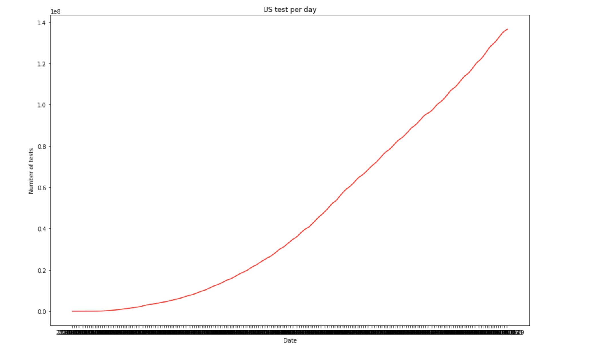
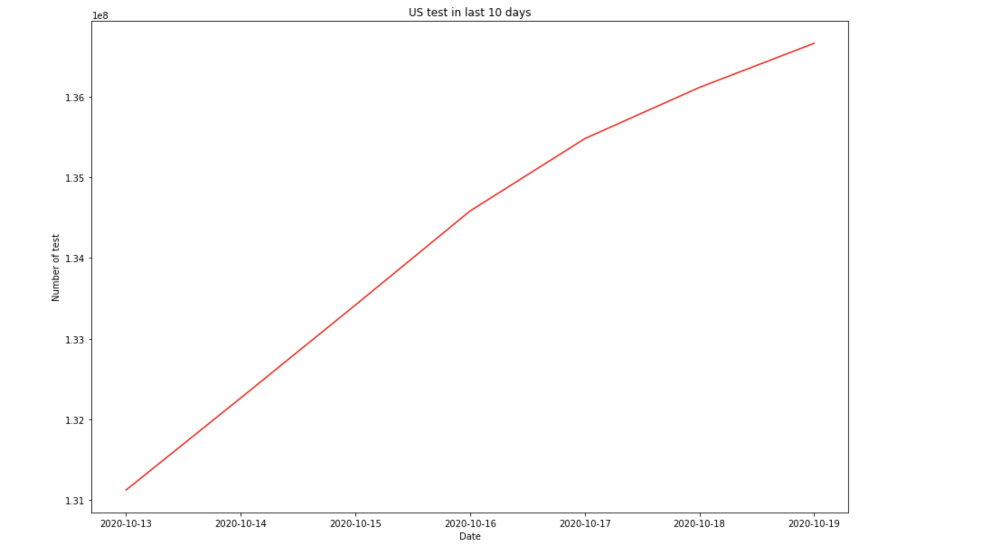
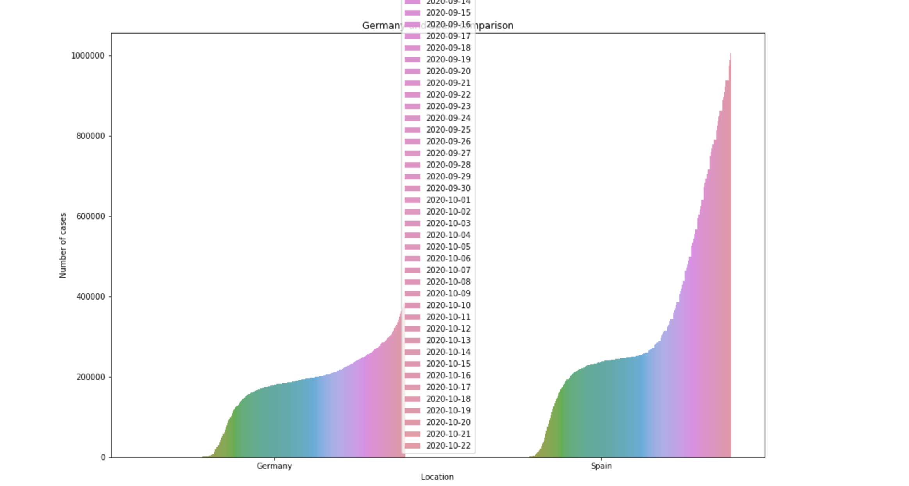
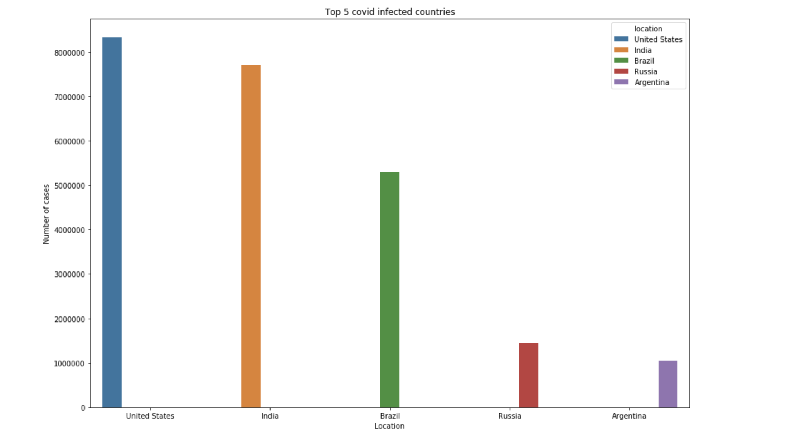
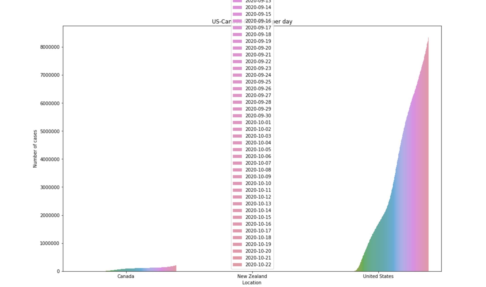

# Predicting the trend of Covid-19

## Basic Overview:

* **Goal**: Analyze the covid-19 trends along and compare countries on their covid response. Create a model that helps forecast the number of cases per day, week and month.

* SARS-COV_2 is spreading like wildfire which has upenended our lives and made the economy go in tatters. The goal of this project is to compare responses of different countries to this pandemic, which can enable countries to model their response in a similar way to succesful countries.

* A timeseries model was created to predict the pandemic cases in the United States.

## Resources and code used:

* ***Python Version***: 3.8
* ***Microsoft Excel***
* ***Packages***: Pandas, Matplotlib, NumPy, Pickle, Sklearn (Linear Regression, Lasso, Decision Tree, train_test_split, mean_squared_error, LinearRegression)
* ***Data Source***: WHO data, WikiPedia data, John Hopkins data

## Data Acquisition:

* Scrapped data from WikiPedia's covid-19 page to get a summarized data of number of cases. Collected data from WHO and John Hopkins university.
* With the help of excel (and Pivot tables) the various data were aggregated to create a clean dataset.
* The dataset consists of about 51798 rows and 41 columns.

## Data Cleaning:

  ### Attribute Selection & data preperation:
    
    * Excel's Pivot Tables were used to clean the disparate data sources.
    * New columns were created per continent, country, and region.
    * Data were combined to create basic data of number of cases, number of tests, number of active cases, and number of deaths per country.
    * Attributes with high correlation were dropped.
    * To perform sound data analysis every country was scaled to have a similar start date.
    * Data for each country is scaled. Therefore, we can be worry free of skewed data.
    

## Visualization:

* A number of charts and graphs were created to analyze the cases:

## Model Building:

* 3 algorithms were tested to build the model - Linear Regression, Lasso, and DecisionTree.
* The following are the results of each algorithm:
* Linear Regression:

* Lasso:

* Decision Tree:

## Conclusion:

* Linear Regression was selected as the ultimate choice for model building. Linear Regression's score and cross validation on test data gave stronger results compared to the other algorithms tested.

## Model Deployment:

* With the help of Pickle library the model was exported as an API.
* Using Flask a server was created to onboard the API and serve an interactable webpage that lets users input the location, bedrooms and bathroom to get the price prediction:

### The file with detailed step-by-step code is [here](/Price_Prediction_of_homes.ipynb).
